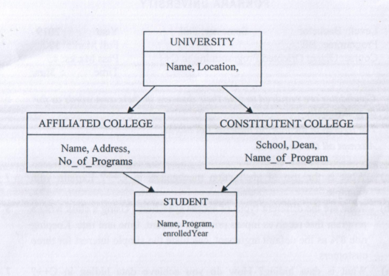

# 2019-Fall

## 1. a) What is the use of abstraction mechanism in C++? Explain with example.

Ans:Abstraction means displaying only essential information and hiding the details. Data abstraction refers to providing only essential information about the data to the outside world, hiding the background details or implementation.

The uses of abstraction mechanism in C++ are:-

- Helps the user to avoid writing the low level code
- Avoids code duplication and increases reusability.
- Can change internal implementation of class independently without affecting the user.
- Helps to increase security of an application or program as only important details are provided to the user.

Example:

```javascript
#include <iostream>
using namespace std;

class implementAbstraction
{
	private:
		int a, b;

	public:
	
		// method to set values of
		// private members
		void set(int x, int y)
		{
			a = x;
			b = y;
		}
		
		void display()
		{
		cout<<"a = " <<a << endl;
		cout<<"b = " << b << endl;
		}
};

int main()
{
	implementAbstraction obj;
	obj.set(10, 20);
	obj.display();
	return 0;
}
```

## 1. b)What are the different types of access specifiers? Using a class write a program that receives inputs principle amount, time and rate. Keeping rate 8% as the default argument, calculate the simple interest for three customers.

Ans: There are 3 types of access modifiers available in C++:

- Public
- Private
- Protected

## 2. a)What is data hiding? How do you achieve data hiding in C++? 7 Explain with a suitable program.

Ans:

## 2. b) What are the advantage of inheritance? Explain multi-level inheritance with example.

Ans:The advantages of imheritance are as follows:

- Inheritance promotes reusability. When a class inherits or derives another class, it can access all the functionality of inherited class.
- Reusability enhanced reliability. The base class code will be already tested and debugged.
As the existing code is reused, it leads to less development and maintenance costs.
- Inheritance makes the sub classes follow a standard interface.
- Inheritance helps to reduce code redundancy and supports code extensibility.
- Inheritance facilitates creation of class libraries.

If a class is derived from another derived class then it is called multilevel inheritance. So in C++ multilevel inheritance, a class has more than one parent class.

)

Example:

```javascript
#include <iostream>
using namespace std;
class base //single base class
{
	public:
 	int x;
 	void getdata()
 	{
    	cout << "Enter value of x= "; cin >> x;
 	}
};
class derive1 : public base // derived class from base class
{
 	public:
 	int y;
 	void readdata()
 	{
 	    cout << "\nEnter value of y= "; cin >> y;
 	}
};
class derive2 : public derive1   // derived from class derive1
{
 	private:
 	int z;
 	public:
 	void indata()
 	{
    	cout << "\nEnter value of z= "; cin >> z;
 	}
 	void product()
 	{
 	    cout << "\nProduct= " << x * y * z;
 	}
};
int main()
{
     derive2 a;      //object of derived class
     a.getdata();
     a.readdata();
     a.indata();
     a.product();
     return 0;
}
```

## 3. a) How can you overload constructors? Explain with suitable example.

Ans: Depending upon the number and type of arguments passed a constructor can be overloaded.

Example:

```javascript
// Source Code to demonstrate the working of overloaded constructors
#include <iostream>
using namespace std;

class Area
{
    private:
       int length;
       int breadth;

    public:
       // Constructor with no arguments
       Area(): length(5), breadth(2) { }

       // Constructor with two arguments
       Area(int l, int b): length(l), breadth(b){ }

       void GetLength()
       {
           cout << "Enter length and breadth respectively: ";
           cin >> length >> breadth;
       }

       int AreaCalculation() {  return length * breadth;  }

       void DisplayArea(int temp)
       {
           cout << "Area: " << temp << endl;
       }
};

int main()
{
    Area A1, A2(2, 1);
    int temp;

    cout << "Default Area when no argument is passed." << endl;
    temp = A1.AreaCalculation();
    A1.DisplayArea(temp);

    cout << "Area when (2,1) is passed as argument." << endl;
    temp = A2.AreaCalculation();
    A2.DisplayArea(temp);

    return 0;
}
```

## 3. b) What is dynamic memory allocation? How do you allocate memory dynamically in C++? Explain with an example.

Ans: Dynamic Memory Allocation can be defined as a procedure in which the size of a data structure (like Array) is changed during the runtime.

There are 4 library functions provided by C defined under <stdlib.h> header file to facilitate dynamic memory allocation in C programming. They are:

- malloc()
- calloc()
- free()
- realloc()

Example of dynamic memory allocation using malloc:

```javascript
#include<stdio.h>  
#include<stdlib.h>  
int main(){  
  int n,i,*ptr,sum=0;
    printf("Enter number of elements: ");
    scanf("%d",&n);
    ptr=(int*)malloc(n*sizeof(int));  //memory allocated using malloc
    if(ptr==NULL)
    {
        printf("Sorry! unable to allocate memory");
        exit(0);
    }
    printf("Enter elements of array: ");
    for(i=0;i<n;++i)
    {
        scanf("%d",ptr+i);
        sum+=*(ptr+i);
    }
    printf("Sum=%d",sum);
    free(ptr);
return 0;  
}
```

## 4. a)The following figure shows minimum information required for each class. Write a program by realizing the necessary member functions to read and display information of induvidual object. Every class should contain at least one constructor and should be inherited to other classes as well.



Ans:

## 4. b) What do you mean by virtual base class? At which condition it has to be implemented? Explain with suitable example.

Ans:

## 5. a) ) What is operator overloading? Write a program to find the sum and difference of any two complex numbers by overloading `+' and`-' operator.

Ans:

## 5. b) Why is 'this' pointer widely used than object pointer? Write a programme to implement pure polymorphism.

Ans:

## 6. a) What is exception? Explain in brief about the exception handling mechanism in C++.

Ans:

## 6. b) Explain CRC card and sequence diagram with suitable example.

Ans:

## 7. Short notes on:

### 1.Software reusability

### 2. b)Template functions

### 3.c)Software component
